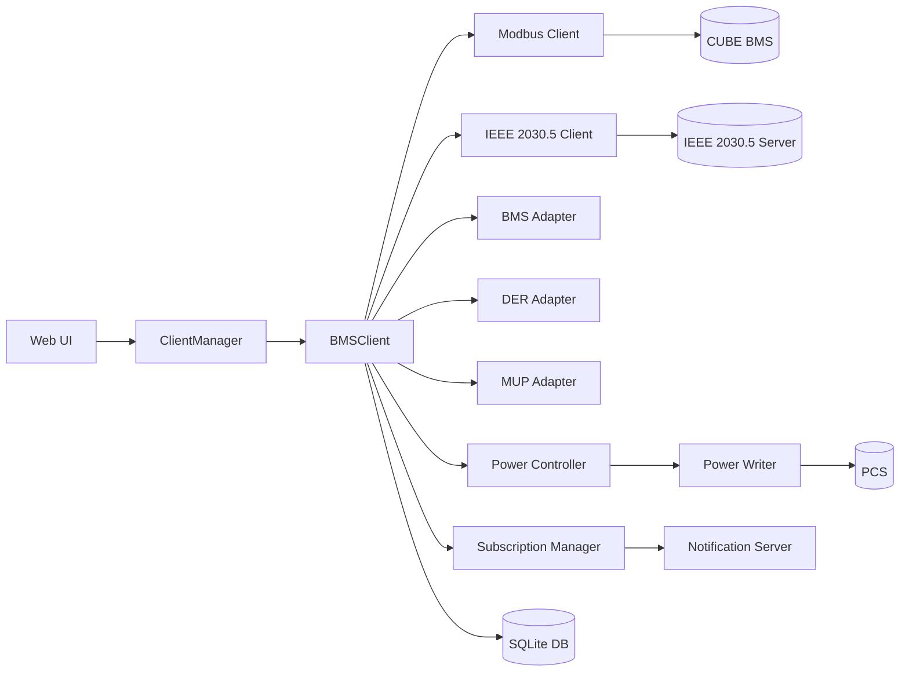
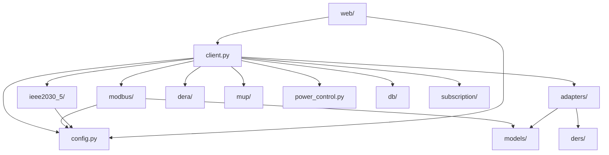
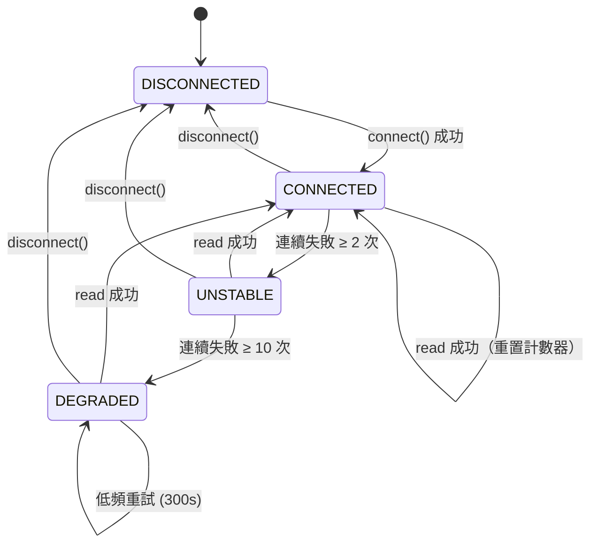
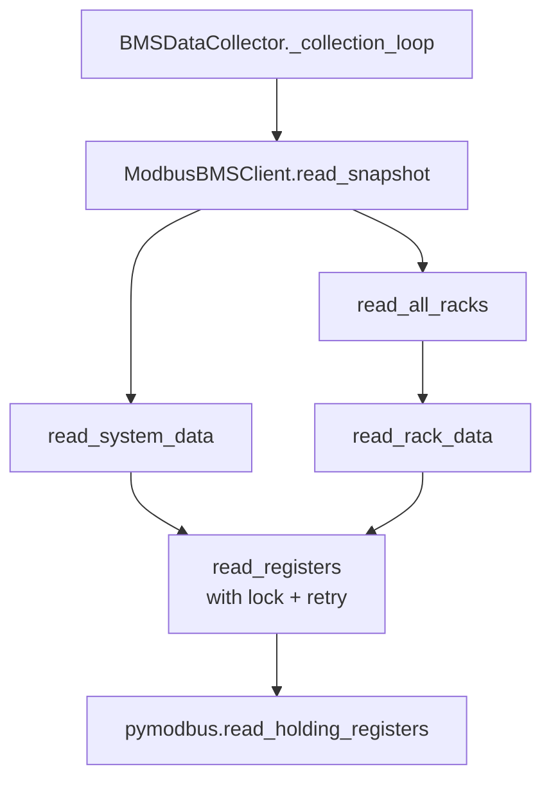
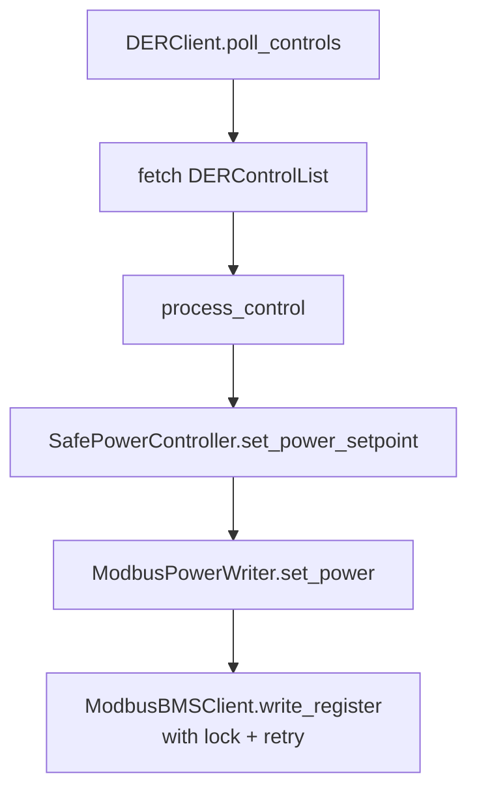

# 專案全面分析報告

> **最後更新**: 2026-03-12  
> **專案名稱**: IEEE 2030.5 BMS Client  
> **版本**: 0.1.0

---

## 1. 專案概述

### 主要功能和目的
本專案實作 BMS（電池管理系統）與 EMS（能源管理系統）之間透過 IEEE 2030.5（Smart Energy Profile 2.0）標準的通訊 Client。

核心功能：
- **Modbus TCP** 通訊：與 CUBE BMS 電池櫃進行資料採集（系統狀態 + 各 Rack 狀態）
- **IEEE 2030.5 協議**：向公用事業伺服器回報 DER 狀態、計量數據、接收 DER 控制指令
- **DER 控制**：支援 Polling 與 Subscription（推播）兩種模式接收控制指令
- **功率控制**：透過 SafePowerController 安全地執行功率設定點寫入（預設 DRY_RUN 模式）
- **Web UI**：Flask 網頁介面供操作人員監控與控制

### 使用的程式語言和主要技術堆疊
- **語言**: Python 3.9+
- **Web 框架**: Flask 3.x
- **Modbus**: pymodbus 3.6+ (AsyncModbusTcpClient)
- **HTTP Client**: httpx + aiohttp
- **加密**: cryptography（TLS 憑證管理、LFDI 衍生）
- **XML**: xsdata + defusedxml（IEEE 2030.5 XML 序列化/反序列化）
- **資料庫**: SQLite（IEEE 2030.5 資源持久化）
- **排程**: asyncio 原生（背景任務、定期輪詢）
- **配置**: PyYAML

---

## 2. 程式碼結構分析

### 主要目錄結構

```
src/bms_2030_5_client/
├── adapters/          # BMS → IEEE 2030.5 資料轉換
├── core/              # SEP Client 核心
├── db/                # SQLite 資料庫層（IEEE 2030.5 資源持久化）
├── dera/              # DER Adapter（DERProgram/DERControl polling）
├── ders/              # DER Status Adapter
├── ieee2030_5/        # IEEE 2030.5 HTTP/TLS Client + XML utilities
├── modbus/            # Modbus TCP Client + Power Writer + Register Writer
├── models/            # Pydantic/dataclass 資料模型
├── mup/               # MirrorUsagePoint Adapter（計量數據上傳）
├── polling/           # Polling Worker
├── protocols/         # 協議定義（Modbus 暫存器表、CAN 訊息、IEEE 2030.5）
├── subs/              # Subscription Manager
├── subscription/      # Notification Server + Handler
├── web/               # Flask Web UI（client_manager、app、templates）
├── client.py          # 主 BMSClient 整合層
├── config.py          # 配置管理（YAML → dataclass）
├── logging_setup.py   # 統一 logging 設定（structlog + file rotation + buffer）
├── power_control.py   # 安全功率控制器 + 緊急停機
├── runtime_config.py  # 執行時配置（runtime.yaml）
├── task_supervisor.py # 背景 Task 監控 + 自動重啟（exponential backoff）
├── cycle_storage.py   # 充放電循環計數持久化
├── external_api.py    # 外部整合 API
└── main.py            # CLI 入口點
```

### 程式碼組織模式

- **分層架構**: API（Web UI）→ Service（BMSClient）→ Adapter → Protocol Client
- **Adapter Pattern**: BMS Modbus 資料 ↔ IEEE 2030.5 DER 模型轉換
- **Singleton Pattern**: `ClientManager` 管理 BMSClient 生命週期
- **Observer Pattern**: Callback 機制（BMSDataCollector → BMSClient → ClientManager → Web UI）
- **State Machine**: BMSDataCollector 使用 `ModbusConnectionState` 管理連線健康
- **Supervisor Pattern**: `TaskSupervisor` 監控全部背景 asyncio Task，異常時自動重啟（exponential backoff）
- **Structured Logging**: `structlog` 統一日誌（JSON / 彩色 console），搭配 `RotatingFileHandler` 寫入磁碟

---

## 3. 功能圖

### 核心功能清單

| 功能模組 | 說明 |
|---------|------|
| Modbus 資料採集 | 定期從 CUBE BMS 讀取系統/Rack 暫存器 |
| IEEE 2030.5 註冊 | EndDevice 自動註冊 + DER 資源建立 |
| DER 狀態回報 | 定期上傳 DERStatus、DERAvailability |
| 計量數據上傳 | MirrorUsagePoint + MirrorMeterReading |
| DER 控制接收 | Polling 或 Subscription 接收 DERControl |
| 功率控制執行 | SafePowerController → Modbus PCS 寫入 |
| Web UI 監控 | 即時狀態、歷史圖表、配置管理 |
| 通知伺服器 | IEEE 2030.5 Notification Server |

### 模組間關係



---

## 4. 依賴關係分析

### 外部依賴函式庫

| 套件 | 用途 |
|------|------|
| pymodbus | Modbus TCP/IP 通訊 |
| httpx | IEEE 2030.5 HTTP/TLS Client |
| aiohttp | 非同步 HTTP |
| cryptography | TLS 憑證、LFDI/SFDI 衍生 |
| xsdata | IEEE 2030.5 XML 序列化 |
| defusedxml | XML 安全解析（防 XXE） |
| flask | Web UI |
| pyyaml | 配置檔載入 |
| structlog | 結構化日誌（JSON / 彩色 console，搭配 RotatingFileHandler）|

### 內部模組依賴



---

## 5. 程式碼品質評估

### 程式碼可讀性
- 良好的 docstring 覆蓋率（英文）
- 一致的命名慣例（snake_case）
- 型別標註使用 Python 3.10+ 語法（`T | None`）

### 測試覆蓋率
- 測試檔案涵蓋：adapter、config、DER client、DER control、function sets、models、power control、subscription
- 缺少：Modbus reconnection/backoff 的專門測試、Web UI 端到端測試

### 潛在改進空間
- `BMSClient` 類別過大（800+ 行），可考慮拆分
- 部分 callback 使用 `asyncio.ensure_future` 需注意例外處理

---

## 6. 關鍵演算法與資料結構

### Modbus 連線健康狀態機



### 指數退避重連
- `BMSDataCollector`: 1s → 2s → 4s → ... → 60s（cap），失敗後不疊加 `refresh_interval`
- `_reconnect_ieee2030_5()`: 2s → 4s → 8s → ... → 120s（cap），最多 10 次
- `read_registers` / `write_register`: 0.1s → 0.2s → 0.4s（最多 3 次重試）

### 充放電循環計算
- SOC 變化追蹤：充電累積 >10% + 放電累積 >10% = 1 cycle
- 持久化：二進位檔案 (`data/cycle_tracking.bin`) + backup

### IEEE 2030.5 快速恢復
- SQLite 緩存 EndDevice/DER/MUP href，重啟後無需重新註冊

---

## 7. 函數呼叫圖

### Modbus 讀取路徑



### DER 控制路徑



---

## 8. 安全性分析

### TLS/憑證
- IEEE 2030.5 連線使用雙向 TLS（Client cert + Server CA）
- LFDI 從憑證依 SHA-256 衍生
- 建議啟用 `check_hostname = True`（參見 copilot/fix-tls-hostname-verification 分支）

### 功率控制安全
- `SafePowerController` 強制功率限制驗證
- 預設 `mode="dry_run"`，生產模式需授權 token
- `EmergencyStop` 提供緊急停機機制

### XML 安全
- 使用 `defusedxml` 防止 XXE / XML bomb

### 敏感資料
- Supabase service_key 應從環境變數讀取
- Config 檔不應包含憑證（建議檢查檔案權限）

---

## 9. 可擴展性和效能

### 擴展設計
- Modbus Client 支援最多 24 Racks
- Subscription/Polling 雙模式可切換
- `ModbusConfig` 可配置 retry 參數（`read_max_retries`、`read_retry_base_delay`）

### 效能關鍵點
- Modbus 讀寫使用 `asyncio.Lock` 序列化，避免並行衝突但限制吞吐量
- `BMSDataCollector` 預設 60 秒輪詢間隔
- DEGRADED 狀態下切換為 300 秒低頻重試，節省資源

### 並發處理
- 全 asyncio 架構
- Web UI 在獨立 thread 運行 event loop
- Modbus 讀寫鎖確保協議序列完整性

---

## 10. 總結與建議

### 主要優勢
- 完整的 IEEE 2030.5 協議實作（註冊、狀態回報、計量、DER 控制）
- 安全的功率控制層（模擬模式保護）
- Modbus 連線健康狀態機（CONNECTED → UNSTABLE → DEGRADED）
- Web UI 提供即時監控能力

### 潛在改進點
1. **Jitter 退避**：多 Client 環境需加入隨機擾動防止 thundering herd
2. **最大重試上限**：DEGRADED 狀態已緩解但可進一步配置化
3. **測試覆蓋**：Modbus reconnection 邏輯缺乏專門的單元測試
4. **BMSClient 拆分**：主類過大，可將 metering/DER control/cycle tracking 拆為獨立模組
5. **TLS 強化**：啟用 hostname 驗證、憑證過期檢查

### 適用場景
- 儲能系統與公用事業 DERMS 整合
- 電池櫃遠端監控與控制
- IEEE 2030.5 合規性驗證
