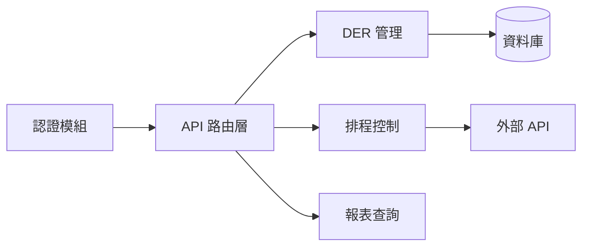

# BMS/EMS Communication Protocol Guidelines

This project implements communication between BMS (Battery Management System) and EMS (Energy Management System) using IEEE 2030.5 standard.

---

## 必讀文件

**在開始任何實作工作之前，必須先閱讀以下報告：**

- `PROJECT_ANALYSIS_REPORT.md` — 專案全面分析報告

此報告涵蓋：專案概述、程式碼結構、功能圖、依賴關係、程式碼品質評估、關鍵演算法、函數呼叫圖、安全性分析、可擴展性與效能、改進建議。

---

## 外部整合 API 參考

**編寫與本 Client 串接的外部程式時，請參考：**
- [COPILOT_INTEGRATION_REFERENCE.md](COPILOT_INTEGRATION_REFERENCE.md) - 完整的外部整合 API 文件

該文件包含：
- `ExternalIntegrationAPI` 完整 API 參考
- `PowerCommand`, `BMSStatusReport` 資料結構定義
- Polling、回調、REST API 三種整合模式範例
- Modbus TCP 與 CAN Bus 整合範例程式碼
- 錯誤碼與告警位元定義

---

## 技術堆疊

- 後端：FastAPI + Flask（WSGI 掛載），SQLAlchemy 2.0 async，Pydantic v2
- 資料庫：PostgreSQL + TimescaleDB
- 排程：APScheduler 3.x（AsyncIOScheduler）
- 外部 API：httpx + tenacity 重試
- 部署：Railway + Gunicorn/Uvicorn

---

## 開發規範

### 語言規範

- **對話與回覆語言**：一律使用**繁體中文**
- **Markdown 報告**：一律使用**繁體中文**撰寫
- **程式碼註解（docstring / comment）**：一律使用**英文**，格式如下：

```python
"""
Function content description.

Args:
    name (type): Parameter content description.

Returns:
    type: Return value content description.
"""
```

### 程式碼風格

- 使用 Python 3.10+ 型別標註（`T | None` 而非 `Optional[T]`）
- ORM 欄位使用 `comment` 參數描述
- 遵循現有命名慣例

### 實作前

1. 閱讀 `PROJECT_ANALYSIS_REPORT.md` 了解專案架構與現有設計模式
2. 確認修改符合分層架構（API → Service → Repository → Model）
3. 新增 API 端點需遵循統一回應格式（`ApiResponse`）
4. 新增模型需配合 Alembic 遷移

#### 修改前影響範圍掃描（強制執行）

> **此規則為強制性**：收到任何涉及「修改既有程式碼」的任務時，**必須先執行本規則再動手**。新增全新檔案不需要。

**步驟：**

1. 用 grep 搜尋目標函數/類別被哪些檔案呼叫：
   ```bash
   grep -rn "function_name" --include="*.py" .
   grep -rn "ClassName" --include="*.py" .
   ```
2. 用 grep 搜尋目標模組被哪些檔案 import：
   ```bash
   grep -rn "from module import" --include="*.py" .
   grep -rn "import module" --include="*.py" .
   ```
3. 整理「受影響檔案清單」
4. 向 `copilot_work_log` 搜尋這些受影響檔案的歷史紀錄，**特別關注 `risk_notes` 欄位**：
   ```python
   collection = client.get_collection("copilot_work_log")
   results = collection.query(
       query_texts=["受影響的檔案名稱 + 功能描述"],
       n_results=5,
       include=["metadatas", "documents"],
   )
   for meta in results["metadatas"][0]:
       if meta.get("risk_notes"):
           print(f"⚠️ 歷史風險: {meta['risk_notes']}")
   ```
5. 基於以上資訊，擬定修改計畫（包含預計連動修改的檔案）
6. 確認修改計畫合理後，才開始實作

#### 事前搜尋知識庫

在開始任何實作任務前，向 `copilot_work_log` 搜尋歷史紀錄：

```python
collection = client.get_collection("copilot_work_log")
results = collection.query(
    query_texts=["任務描述 + 受影響檔案名稱"],
    n_results=5,
    include=["metadatas", "documents", "distances"],
)

for i, meta in enumerate(results["metadatas"][0]):
    print(f"[{i}] {meta['summary']} (距離: {results['distances'][0][i]:.4f})")
    if meta.get("code_anchors"):
        print(f"    錨點: {meta['code_anchors']}")
    if meta.get("decision_rationale"):
        print(f"    決策: {meta['decision_rationale']}")
    if meta.get("risk_notes"):
        print(f"    ⚠️ 風險: {meta['risk_notes']}")
```

**重點：**
- 用任務描述 + 受影響檔案名稱作為 query（取前 5 筆）
- 留意 `code_anchors`、`decision_rationale`、`risk_notes`
- 如有相關紀錄，參考其做法避免重複實作，迴避已知風險

### 實作後

1. 確認程式碼通過型別檢查
2. 更新 `PROJECT_ANALYSIS_REPORT.md`（圖表使用 Mermaid）

> **Phase 2 啟用前**：依照下方完整架構更新報告中受影響的章節。
>
> **Phase 2 啟用後**：報告僅保留定性分析章節（1、3、5、6、8、9、10），結構性資料（2、4、7）改由 `code_structure` collection 自動維護，不再寫入報告。

#### Phase 2 啟用前：完整報告架構

   ## 1. 專案概述
   - 專案的主要功能和目的
   - 使用的程式語言和主要技術堆疊
   
   ## 2. 程式碼結構分析 ⬅ Phase 2 後移至 `code_structure`
   - 主要目錄結構及其用途
   - 關鍵原始碼檔案及其作用
   - 程式碼組織模式（設計模式、架構模式等）
   - 模組化程度評估
   
   ## 3. 功能圖 ⬅ Phase 2 後改為「高階功能地圖」
   - 核心功能清單及描述
   - 功能之間的關係和互動方式
   - 使用者流程圖（如適用）
   - API介面分析（如適用）
   
   ## 4. 依賴關係分析 ⬅ Phase 2 後移至 `code_structure`
   - 外部依賴函式庫清單及用途
   - 內部模組間依賴關係圖
   - 依賴更新頻率和維護狀況
   - 潛在的依賴風險評估
   
   ## 5. 程式碼品質評估
   - 程式碼可讀性
   - 註解和文件完整性
   - 測試覆蓋率
   - 潛在的程式碼異味和改進空間
   
   ## 6. 關鍵演算法與資料結構
   - 專案中使用的主要演算法分析
   - 關鍵資料結構及其設計原理
   - 效能關鍵點分析
   
   ## 7. 函數呼叫圖 ⬅ Phase 2 後移至 `code_structure`
   - 主要函數/方法列表
   - 函數呼叫關係視覺化
   - 高頻呼叫路徑分析
   - 遞歸和複雜呼叫鏈識別
   
   ## 8. 安全性分析
   - 潛在的安全漏洞
   - 敏感資料處理方式
   - 認證和授權機制評估
   
   ## 9. 可擴展性和效能
   - 擴展設計評估
   - 效能瓶頸識別
   - 並發處理機制分析
   
   ## 10. 總結與建議
   - 專案整體品質評價
   - 主要優勢和特色
   - 潛在改進點和建議
   - 適用場景推薦

#### Phase 2 啟用後：精簡報告架構

報告僅更新以下章節（結構性章節 2、4、7 已移除）：

   ## 1. 專案概述
   ## 3. 功能圖（高階功能地圖）
   ## 5. 程式碼品質評估
   ## 6. 關鍵演算法與資料結構
   ## 8. 安全性分析
   ## 9. 可擴展性和效能
   ## 10. 總結與建議

結構性資料改為按需查詢 `code_structure` collection（透過規則四自動維護）。

**第 3 節瘦身規則（Phase 2 啟用後生效）：**

報告內第 3 節僅保留**高階功能地圖**，不再逐一列舉每個 API 端點：

- **報告內（§ 3）**：只寫功能模組分類 + 模組間關係 Mermaid 圖（粒度到「模組」而非「端點」）
- **API 明細**：搬至 `docs/api_reference.md` 或直接使用 FastAPI 自動生成的 `/docs`
- **功能標記**：每個函數在 `code_structure` collection 的 metadata 中加入 `feature_tag` 欄位，標記所屬功能模組

報告第 3 節範例粒度：

此粒度下，只在新增「功能模組」時報告才需更新，新增 API 端點不再造成報告膨脹。

3. 尤其需更新：功能清單、API 介面分析、依賴關係、程式碼品質、函數呼叫圖等

#### 事後寫入知識庫

完成實作後，將紀錄寫入 `copilot_work_log`。

**Document 格式**（結構化文字）：

```
[專案名稱] 實作摘要

## Code Anchors
- file.py::ClassName::method_name
- another.py::helper_function

## Dependencies Affected
- src/module_a.py
- src/module_b.py

## Decision Rationale
選擇這個方法的原因...

## Risk Notes
已知風險或踩坑經驗...

## Details
詳細實作說明...
Files: file1.py, file2.py
Tags: tag1, tag2
```

**Metadata 欄位**（共 12 個）：

```python
import uuid
from datetime import datetime, timezone

collection = client.get_collection("copilot_work_log")
collection.add(
    ids=[str(uuid.uuid4())],
    documents=[document],  # 上述結構化文字
    metadatas=[{
        "project_name": "專案名稱",
        "project_path": "/path/to/project",
        "summary": "一行摘要",
        "files_changed": "file1.py, file2.py",
        "tags": "tag1, tag2",
        "github_repo": "owner/repo",
        "timestamp": datetime.now(timezone.utc).isoformat(),
        # v3 新增欄位
        "code_anchors": "file.py::Class::method, other.py::func",
        "dependencies_affected": "module_a.py, module_b.py",
        "decision_rationale": "為什麼選擇這個做法",
        "risk_notes": "踩坑紀錄或注意事項",
        "change_type": "feature",  # feature / bugfix / refactor / config
    }],
)
```

**`code_anchors` 格式規範**（函數級）：
- Python: `file.py::ClassName::method_name` 或 `file.py::function_name`
- TypeScript: `file.ts::ClassName.methodName` 或 `file.ts::functionName`
- 每個被修改的函數/方法都應列出

### Testing Guidelines

- Use mock Modbus server for unit tests
- Validate all register conversions
- Test boundary values (0, max, negative)
- Verify bitfield parsing
- Test IEEE 2030.5 XML serialization

### 🔄 實作後自動 Commit 與重啟規範

**CRITICAL: 每次完成程式碼改動後，必須執行以下流程**

#### 流程
1. **完成實作** — 確認改動可正常運作（無語法錯誤）
2. **僅 Commit 自己改動的檔案** — 使用 `git add <具體檔案>` 逐一加入
3. **撰寫有意義的 Commit Message** — 描述本次改動內容
4. **重新啟動 Web UI** — 停止舊程序並重新啟動

#### 絕對禁止 (NEVER)
- ❌ 使用 `git add .` 或 `git add -A`（會把其他 agent 的改動一起提交）
- ❌ Commit 不屬於當前任務的檔案
- ❌ 在未確認改動正確前就 Commit
- ❌ 忘記重啟 Web UI

#### 必須遵守 (ALWAYS)
- ✅ 使用 `git add <file1> <file2> ...` 明確指定要 Commit 的檔案
- ✅ Commit 前先用 `git diff --cached` 確認暫存區只有自己的改動
- ✅ Commit 前先用 `git status` 檢查，確保沒有誤加其他檔案
- ✅ Commit Message 使用英文，格式：`<type>: <description>`
- ✅ Commit 後重啟 Web UI

#### 標準操作流程
```bash
# 1. 確認哪些是自己改動的檔案
git status

# 2. 只加入自己改動的檔案（逐一指定）
git add src/bms_2030_5_client/path/to/changed_file.py
git add src/bms_2030_5_client/path/to/another_file.py

# 3. 確認暫存區內容正確
git diff --cached --stat

# 4. Commit
git commit -m "feat: add XXX functionality"

# 5. 重啟 Web UI
fuser -k 5000/tcp 2>/dev/null
sleep 1
cd /home/us2st/ieee2030.5-cold-client
source .venv/bin/activate
bms-web --debug
```

#### Commit Message 格式
| Type | 用途 |
|------|------|
| `feat` | 新功能 |
| `fix` | 修正 Bug |
| `refactor` | 重構（不改變行為） |
| `docs` | 文件更新 |
| `style` | 格式調整 |
| `test` | 測試相關 |

---

## 跨專案知識庫（ChromaDB）連線資訊

本專案使用中央 ChromaDB 知識庫進行跨專案知識共享。所有 Copilot Agent **必須遵守**以下規則。

- **ChromaDB Server**: `https://{CHROMA_HOST}`（從環境變數 `CHROMA_HOST` 讀取）
- **認證方式**: Bearer Token（從環境變數 `CHROMA_AUTH_TOKEN` 讀取）
- **Python 套件**: `chromadb`（需安裝在專案 venv 中）

> **安全須知**：Token 禁止寫死在程式碼或文件中。每個專案的 `.env` 檔必須加入 `.gitignore`。

連線範例：

```python
import os
import chromadb

client = chromadb.HttpClient(
    host=os.environ["CHROMA_HOST"],
    port=443,
    ssl=True,
    headers={"Authorization": f"Bearer {os.environ['CHROMA_AUTH_TOKEN']}"},
)
```

**Token 設定方式**（優先順序：環境變數 → `.env` → GCP Secret Manager）：

1. **專案 `.env` 檔**（已加入 `.gitignore`，不會進 Git）：
   ```
   CHROMA_HOST=chroma-production-2295.up.railway.app
   CHROMA_AUTH_TOKEN=your-token-here
   ```

2. **GCP Secret Manager**（自動 fallback，無需手動設定）：
   當 `.env` 不存在時，自動從 GCP Secret Manager 讀取：
   ```bash
   gcloud secrets versions access latest --secret=CHROMA_HOST --project=xenon-raceway-442501-a8
   gcloud secrets versions access latest --secret=CHROMA_AUTH_TOKEN --project=xenon-raceway-442501-a8
   ```
   前提：安裝 `gcloud` CLI 且已執行 `gcloud auth login`。
   GCP VM 上透過 service account 自動認證，完全零設定。

Copilot Agent 在執行規則前，先讀取 `.env`：
```python
from dotenv import load_dotenv
load_dotenv()  # 讀取專案 .env
```

或直接在終端執行：
```bash
export $(grep -v '^#' .env | xargs) && python your_script.py
```

### 🛑 知識庫連線斷路器 (Knowledge Base Circuit Breaker)

**CRITICAL: 所有 Agent 在執行任何任務（包含原始碼掃描、讀取、分析或修改）之前，必須先完成 ChromaDB 的連線測試與認證。**

1. Agent 必須嘗試獲取 `CHROMA_AUTH_TOKEN` 並對知識庫發起測試查詢。
2. **強制中斷條件（Halt Condition）**：如果發生以下任一狀況，Agent **必須立即終止所有操作**，輸出連線失敗的錯誤報告，且**絕對禁止**進行任何程式碼的生成、修改或提供實作建議：
   - 發現環境中缺少有效的 `CHROMA_AUTH_TOKEN`。
   - ChromaDB 回應 401 Unauthorized 或連線失敗。
3. 理由：本專案具備高度上下文依賴，在未成功取得 ChromaDB 歷史風險紀錄與協議規範授權前，任何盲目的程式碼更動皆被視為嚴重違反專案安全與架構規範。

---

## ⚠️ Power Control Safety Rules (功率控制安全規範)

**CRITICAL: 開發功率控制功能時必須遵守以下規則**

完整規範請參考: [`.github/power-control-safety.md`](power-control-safety.md)

### 摘要
- ❌ **絕對禁止**：直接向 PCS 發送指令、繞過模擬模式、硬編碼 PCS 端點、測試連接實際設備
- ✅ **必須遵守**：預設 `simulation_mode=True`、使用 `SafePowerController`、驗證功率限制、記錄所有請求到日誌
- **安全模式層級**：`SIMULATION`（開發）→ `DRY_RUN`（驗證）→ `PRODUCTION`（需授權 token）
- **DER Control 處理**：解析 → 驗證功率範圍 → 檢查模式 → 記錄審計日誌 → 僅生產模式執行

---

## 🚀 Web UI 啟動方式

### 環境準備（首次）
```bash
cd /home/us2st/ieee2030.5-cold-client
python3 -m venv .venv
source .venv/bin/activate
pip install -e .
```

### 啟動 Web UI
```bash
cd /home/us2st/ieee2030.5-cold-client
source .venv/bin/activate
bms-web --debug
```

- **預設位址:** `http://0.0.0.0:5000/`
- **Debug 模式:** 支援自動重載與詳細日誌
- **配置檔:** `config/runtime.yaml`
- **自訂 Port:** `bms-web --debug --port 8080`

### 重新啟動
```bash
# 停止舊程序
fuser -k 5000/tcp 2>/dev/null
sleep 1

# 重新啟動
cd /home/us2st/ieee2030.5-cold-client
source .venv/bin/activate
bms-web --debug
```

---

## Protocol Reference Files

When working with this project, refer to the following source files and protocol documentation:

**Source files:**
- `src/bms_2030_5_client/protocols/modbus_registers.py` - RS-485 and CUBE register definitions
- `src/bms_2030_5_client/protocols/can_messages.py` - CAN 2.0B message definitions
- `src/bms_2030_5_client/protocols/ieee2030_5_protocol.py` - IEEE 2030.5 Smart Energy Profile definitions

**Protocol specification docs (detailed register tables, conversion rules):**
- [RS-485 Modbus RTU + CAN 2.0B](.github/protocols/rs485-modbus.md) — BMS V1.7 registers, CAN bus definitions
- [CUBE Modbus TCP/IP](.github/protocols/cube-modbus.md) — System/Rack registers, address offset rules

> **IEEE 2030.5 相關規範**：不使用靜態文件，統一透過 ChromaDB `ieee2030_5` collection 語義搜尋查詢。
> 詳見下方「專用規則 > IEEE 2030.5 規範查詢」。

---

## 專用規則

### IEEE 2030.5 規範查詢（唯一入口）

ChromaDB `ieee2030_5` collection 是 **IEEE 2030.5 所有規範查詢的唯一入口**。
當實作涉及 IEEE 2030.5 協議的資源、功能集、DER 控制、值轉換等，一律透過語義搜尋查詢：

```python
ieee_collection = client.get_collection("ieee2030_5")
results = ieee_collection.query(
    query_texts=["你的問題，如：DERProgram resource structure"],
    n_results=5,
    include=["metadatas", "documents", "distances"],
)

for i, doc in enumerate(results["documents"][0]):
    meta = results["metadatas"][0][i]
    source = meta.get("source", "ieee_spec")
    if source == "ieee_spec":
        print(f"[規範] §{meta.get('section_title')} (p.{meta.get('start_page')}-{meta.get('end_page')})")
    else:
        print(f"[{source}] {meta.get('file_path', 'N/A')}")
    print(f"  {doc[:200]}...")
```

**使用原則：**
- 用資源名稱或功能描述作為 query 語義搜尋
- 可用 `where` 過濾特定來源：`where={"source": "ieee_spec"}`
- 在程式碼註解中引用章節號（如 `Section 10.10`）
- 不直接引用靜態 `.md` 文件作為 IEEE 2030.5 規範依據

### 結構索引更新（Phase 2 啟用後生效）

> 此規則在 Phase 2 啟用前**不需要執行**。

當新增或修改了函數/類別定義時：

1. 用 tree-sitter 解析被修改的檔案
2. 提取函數簽名、docstring、呼叫關係
3. 更新 `code_structure` collection 中對應的 document
4. 確保 `calls` 和 `called_by` metadata 保持最新