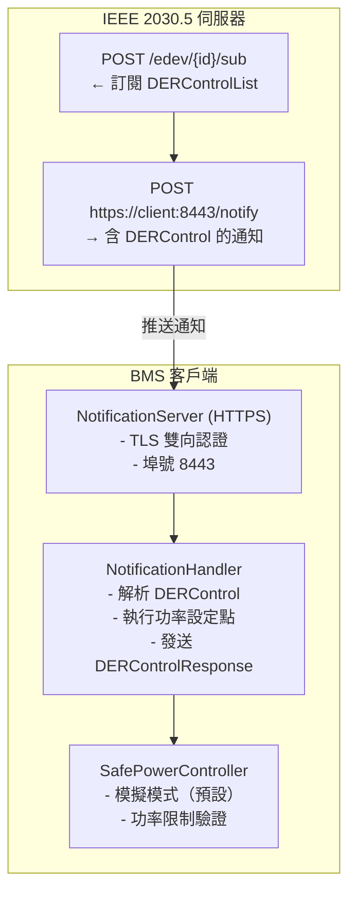

# IEEE 2030.5 訂閱/通知模組

訂閱/通知模組 - 推送式 DER 控制

## 概述

本模組實作 IEEE 2030.5-2023 訂閱/通知機制（第 8.9 條款），提供推送式 DER 控制，實現近即時的電力調度響應。

### 主要優點

| 功能 | 輪詢 | 訂閱 |
|------|------|------|
| 延遲 | 30-60 秒 | < 1 秒 |
| 網路流量 | 高 | 低 |
| 即時控制 | ❌ | ✅ |
| 電池需量反應 | 慢 | 快 |

## 架構



## 組件

### 1. NotificationServer

接收 IEEE 2030.5 伺服器推送通知的 HTTPS 伺服器。

```python
from bms_2030_5_client.subscription import (
    NotificationServer,
    NotificationServerConfig,
)

config = NotificationServerConfig(
    host="0.0.0.0",
    port=8443,
    cert_file="certs/client.crt",
    key_file="certs/client.key",
    ca_file="certs/ca.crt",
)

server = NotificationServer(config)
server.set_notification_handler(my_handler)
await server.start()
```

### 2. SubscriptionManager

管理訂閱生命週期：建立、追蹤、續訂、清理。

```python
from bms_2030_5_client.subscription import (
    SubscriptionManager,
    SubscriptionManagerConfig,
)

config = SubscriptionManagerConfig(
    renewal_interval_hours=24.0,
    limit=10,
)

manager = SubscriptionManager(
    http_client=ieee_client,
    notification_uri="https://192.168.1.100:8443/notify",
    config=config,
)

# 設定完整訂閱鏈
await manager.setup_subscriptions()

# 啟動續訂迴圈
await manager.start_renewal_loop()
```

### 3. NotificationHandler

依類型路由並處理通知。

```python
from bms_2030_5_client.subscription import (
    NotificationHandler,
    NotificationHandlerConfig,
)

handler = NotificationHandler(
    http_client=ieee_client,
    subscription_manager=sub_manager,
    control_handler=der_control_handler,
)

# 設定回呼函式
handler.set_on_control_received(my_control_callback)
handler.set_on_default_control(my_default_callback)
```

### 4. TimeSyncClient

處理時間同步（強制輪詢 - `/tm` 無法訂閱）。

```python
from bms_2030_5_client.subscription import (
    TimeSyncClient,
    TimeSyncConfig,
)

config = TimeSyncConfig(
    sync_interval_s=900,  # 根據 IEEE 2030.5 最少 15 分鐘
    max_drift_s=5.0,
)

time_sync = TimeSyncClient(http_client=ieee_client, config=config)
await time_sync.start_sync_loop()
```

## 訂閱鏈

根據 IEEE 2030.5-2023，客戶端必須訂閱一連串資源：

```
EndDevice → FunctionSetAssignmentsList (FSA)
    └→ DERProgramList
        └→ DERControlList      ← 主要：功率控制指令
        └→ DefaultDERControl   ← 預設備援控制
```

### 為何需要鏈式訂閱？

1. **FSA 變更**：裝置可能被重新分配到不同程式
2. **DERProgram 變更**：程式可能被新增或移除
3. **DERControl 事件**：實際功率設定點指令

## 配置

### config.yaml

```yaml
subscription:
  enabled: true
  notification_host: "0.0.0.0"
  notification_port: 8443
  public_uri: "https://192.168.1.100:8443/notify"  # 伺服器可存取的 URI
  time_sync_interval: 900  # 15 分鐘
  subscription_renewal_interval: 86400  # 24 小時
```

### 環境變數

```bash
# 開發/測試（預設）
POWER_CONTROL_MODE=dry_run

# 生產環境（需要授權）
POWER_CONTROL_MODE=production
POWER_CONTROL_SAFETY_TOKEN=<secure_token>
```

## 與 BMSClient 搭配使用

### 啟用訂閱模式

```python
from bms_2030_5_client import BMSClient
from bms_2030_5_client.config import Config

config = Config.from_yaml("config/config.yaml")

# 方式 1：透過 config.yaml（subscription.enabled=true）
client = BMSClient(config)

# 方式 2：執行時覆寫
client = BMSClient(
    config,
    enable_subscription=True,
    notification_host="0.0.0.0",
    notification_port=8443,
)

await client.start()
# 訂閱式控制現已啟用
```

## 訊息流程

### 1. 訂閱請求

客戶端 → 伺服器：
```xml
POST /edev/{id}/sub
Content-Type: application/sep+xml

<Subscription xmlns="urn:ieee:std:2030.5:ns">
  <subscribedResource>/edev/{id}/fsa/{fsa}/derp/{derp}/derc</subscribedResource>
  <notificationURI>https://client:8443/notify</notificationURI>
  <encoding>0</encoding>
  <level>+S2</level>
  <limit>10</limit>
</Subscription>
```

伺服器 → 客戶端：
```
HTTP/1.1 201 Created
Location: /edev/{id}/sub/{sub_id}
```

### 2. 通知（推送）

伺服器 → 客戶端：
```xml
POST https://client:8443/notify
Content-Type: application/sep+xml

<Notification xmlns="urn:ieee:std:2030.5:ns">
  <subscribedResource>/edev/{id}/fsa/{fsa}/derp/{derp}/derc</subscribedResource>
  <status>0</status>
  <newResourceURI>/edev/{id}/fsa/{fsa}/derp/{derp}/derc/{control}</newResourceURI>
  <Resource>
    <DERControl>...</DERControl>
  </Resource>
</Notification>
```

客戶端 → 伺服器：
```
HTTP/1.1 204 No Content
```

### 3. DERControlResponse

客戶端 → 伺服器：
```xml
POST /edev/{id}/rsps
Content-Type: application/sep+xml

<DERControlResponse xmlns="urn:ieee:std:2030.5:ns">
  <createdDateTime>1704067200</createdDateTime>
  <endDeviceLFDI>AABBCCDD...</endDeviceLFDI>
  <status>1</status>  <!-- 事件已開始 -->
  <subject>abc123def456...</subject>
  <DERControlModes>
    <opModFixedW>50000</opModFixedW>
  </DERControlModes>
</DERControlResponse>
```

## 安全考量

⚠️ **重要**：功率控制安全規則適用！

1. **模擬模式（預設）**
   - 所有功率指令只記錄，不執行
   - 適合開發與測試使用

2. **生產模式**
   - 需要明確授權
   - 執行前驗證所有功率限制
   - 完整稽核日誌

完整安全指南請參閱 `.github/power-control-safety.md`。

## 測試

```bash
# 執行訂閱模組測試
pytest tests/test_subscription.py -v

# 執行並產生覆蓋率報告
pytest tests/test_subscription.py --cov=bms_2030_5_client.subscription
```

## 參考資料

- IEEE Std 2030.5-2023，第 8.9 條款（訂閱/通知）
- IEEE Std 2030.5-2023，第 9.2.3 條款（時間資源）
- IEEE Std 2030.5-2023，第 10.10 條款（DER 功能集）
